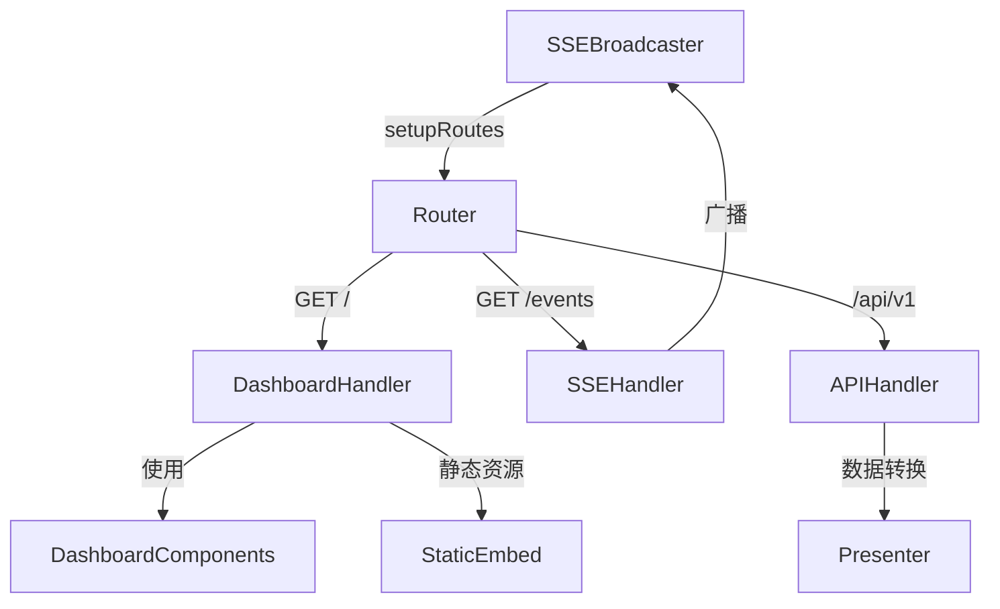

## 产品概述

重构 Go 项目的 server.go 文件，参考 Elixir 项目的代码组织水平，将当前约 1350 行的单文件拆分为模块化结构，提升代码可维护性和可扩展性。

## 核心功能

- 创建独立的路由层
- 拆分 Handler 层
- 引入 Presenter 数据转换层
- 提取静态资源（CSS/JS）
- 创建可重用的渲染组件
- 保持现有功能完全不变

## 技术栈

- 框架: Gin v1.9.1
- Go 版本: 1.22+
- 静态资源: Go embed 指令
- 架构: DDD (domain → app → infra)

## 实现方案

采用**渐进式重构策略**，按照 Elixir 项目的分层架构拆分 server.go：

### 核心设计决策

- **embed 嵌入静态资源**：使用 Go 1.16+ embed 指令将 CSS/JS 嵌入二进制，避免外部依赖
- **Handler 按职责分离**：API handlers、页面 handlers、SSE handler 独立
- **Presenter 层解耦**：数据转换逻辑从 handler 中提取到独立模块
- **组件化 HTML 渲染**：可重用的 HTML 片段函数

### 性能与可靠性

- 避免不必要的模板解析开销，使用字符串拼接
- SSE 广播器保持现有并发模型
- embed 资源在编译时嵌入，运行时零 I/O 开销

## 架构设计

### 重构前（当前）

```
internal/server/server.go (1350行)
├── SSEBroadcaster
├── Server 结构体
├── setupRoutes()
├── handleDashboardCSS()      # CSS 字符串返回
├── handleDashboard()        # HTML 模板内嵌
├── handleSSE()            # SSE 处理
├── handleGetState()        # API handler
├── handleGetIssue()        # API handler
├── handleRefresh()         # API handler
├── buildStatePayload()     # 数据转换
├── renderRunningSessions() # HTML 渲染
├── renderRetryQueue()     # HTML 渲染
├── 辅助函数
└── dashboardCSS 常量      # 455行 CSS
```

### 重构后（目标）

```
internal/server/
├── server.go                # 主服务器（SSE广播器、初始化、启动）
├── router.go               # 路由定义
├── handlers/
│   ├── api_handler.go      # API handlers (state/issue/refresh)
│   ├── dashboard_handler.go # 仪表板页面 handler
│   └── sse_handler.go     # SSE handler
├── presenter/
│   └── presenter.go        # 数据转换层
├── components/
│   └── dashboard.go       # HTML 渲染组件
├── static/
│   ├── dashboard.css       # CSS 文件
│   └── embed.go          # embed 定义
└── types.go              # 共享类型定义
```

### 架构图



## 实现细节

### 目录结构

```
internal/server/
├── server.go              # [MODIFY] 精简主服务器
├── router.go             # [NEW] 路由定义和注册
├── types.go              # [NEW] 共享类型定义
├── handlers/             # [NEW] Handler 层
│   ├── api_handler.go    # API handlers (handleGetState/handleGetIssue/handleRefresh)
│   ├── dashboard_handler.go # Dashboard 页面 handler (handleDashboard)
│   └── sse_handler.go    # SSE handler (handleSSE)
├── presenter/            # [NEW] 数据转换层
│   └── presenter.go     # 数据转换函数
├── components/          # [NEW] 渲染组件
│   └── dashboard.go    # HTML 渲染函数
└── static/              # [NEW] 静态资源
    ├── dashboard.css     # CSS 文件
    └── embed.go        //go:embed 定义
```

### 核心接口与类型

**types.go** - 共享类型

- StatePayload - 状态载荷
- RunningEntryPayload - 运行条目载荷
- RetryEntryPayload - 重试条目载荷
- Tokens - Token 统计

**presenter.go** - 数据转换接口

- BuildStatePayload(orch *orchestrator.Orchestrator) *StatePayload
- BuildIssuePayload(identifier string, state *domain.OrchestratorState) (map[string]any, error)
- BuildRefreshPayload() map[string]any

**components/dashboard.go** - 渲染组件

- RenderMetrics() string
- RenderRunningTable(entries []RunningEntryPayload) string
- RenderRetryTable(entries []RetryEntryPayload) string
- RenderDashboardHTML(statePayload *StatePayload, state *domain.OrchestratorState) string

### 路由迁移

**router.go** - 独立路由定义

```
func SetupRouter(server *Server, engine *gin.Engine) {
    // 静态资源
    engine.GET("/dashboard.css", handlers.HandleDashboardCSS)
    
    // 主页
    engine.GET("/", handlers.NewDashboardHandler(server).Handle)
    
    // SSE
    engine.GET("/events", handlers.NewSSEHandler(server.broadcaster).Handle)
    
    // API
    api := engine.Group("/api/v1")
    {
        api.GET("/state", handlers.NewAPIHandler(server.orchestrator).HandleGetState)
        api.GET("/:identifier", handlers.NewAPIHandler(server.orchestrator).HandleGetIssue)
        api.POST("/refresh", handlers.NewAPIHandler(server.orchestrator).HandleRefresh)
    }
}
```

### 静态资源分离

- 将 `dashboardCSS` 常量（455行）提取到 `static/dashboard.css`
- 使用 embed 指令嵌入二进制

```
//go:embed dashboard.css
var dashboardFS embed.FS
```

### HTML 模板拆分

- `handleDashboard` 中的 HTML 模板（240行）拆分到 `components/dashboard.go`
- 将指标卡片、表格等部分提取为独立函数
- 保留 HTMX SSE JavaScript 逻辑

## 执行注意事项

- **向后兼容**：所有 API 端点和功能保持不变
- **测试覆盖**：重构后确保现有测试通过
- **渐进式重构**：先创建新文件，后删除旧代码，避免中断
- **日志一致性**：保持现有日志级别和格式
- **SSE 广播器**：保持现有并发模型，不修改核心逻辑

本任务为后端代码重构，不涉及 UI 变更。前端页面结构和样式保持完全一致，仅进行代码组织层面的重构。

# Agent Extensions

无需要扩展